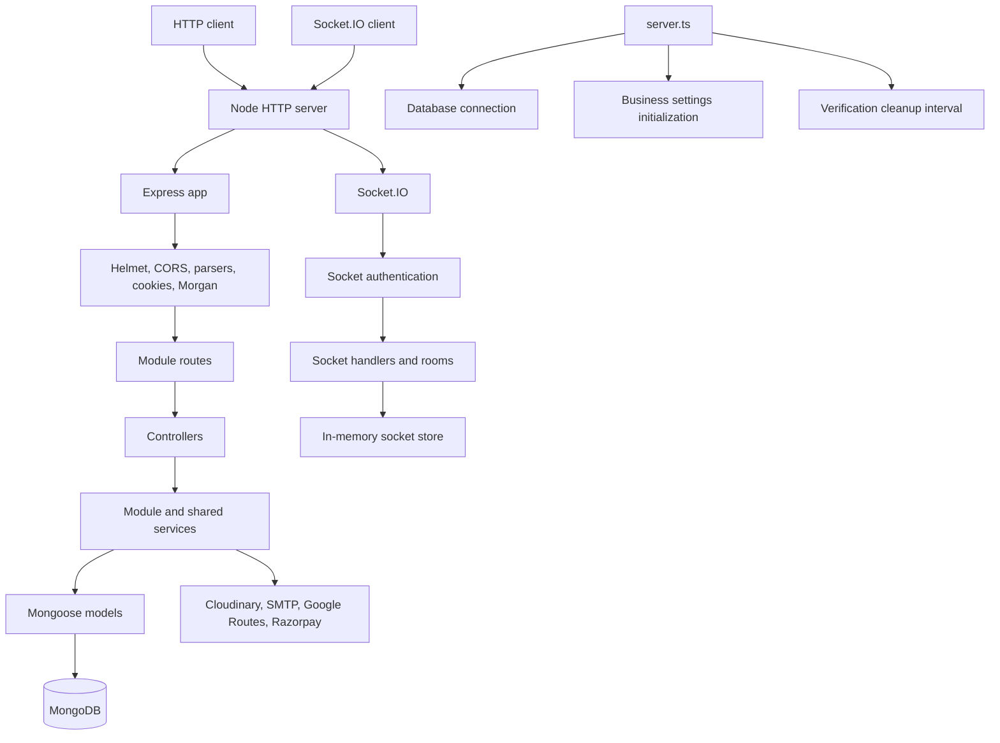

# RiderGO Backend Architecture

## Scope

The RiderGO backend is a TypeScript ESM Node.js service. It uses Express for HTTP, Mongoose for MongoDB persistence, Socket.IO for realtime communication, and separate modules for the main business areas. This document describes the implementation currently present in `backend/src`.

## High-level architecture



The code uses a modular architecture. Each major domain generally contains routes, controllers, services, models, and types. Cross-cutting integrations are in `services` or `config`; authentication and request concerns are in `middlewares` and `utils`.

## Express initialization and startup

`app.ts` creates the Express application and configures it in this order:

1. `/api/payments/webhook` is given an `express.raw({ type: "application/json" })` parser and the Razorpay webhook controller. The raw body is required for signature verification.
2. Helmet is registered.
3. CORS permits `env.CLIENT_URL` and credentials.
4. JSON and URL-encoded body parsers are registered.
5. Cookies are parsed and Morgan logs requests in `dev` format.
6. Module routers are mounted.
7. Not-found handling and the error middleware are mounted last.

`server.ts` owns process startup. It connects to MongoDB, initializes business settings, creates an HTTP server around Express, attaches Socket.IO, and then listens on `env.PORT`. Startup failures are logged and terminate the process with exit code `1`.

The server also starts a two-minute interval that calls `cleanupExpiredVerificationUsers`. The ride-offer timeout job is implemented, but its invocation in `server.ts` is commented out and therefore is not active through the current startup path.

## MongoDB connection flow

Importing `config/env.ts` loads dotenv values and validates required variables. `server.ts` calls `connectDatabase()` before creating the listening HTTP server. `config/database.ts` calls `mongoose.connect(env.MONGO_URI)`, logs successful connection, and exits the process when connection fails. Domain models define Mongoose schemas, timestamps, and indexes; driver matching uses a `2dsphere` index and `$geoNear`.

Business settings are initialized after the database connection and before the server starts listening. No explicit graceful-shutdown handler is confirmed in the current codebase.

## HTTP request lifecycle

```text
Client
	-> Express application
	-> webhook raw-body handling (webhook only)
	-> Helmet / CORS / body parsers / cookies / Morgan
	-> mounted module route
	-> authentication, authorization, activity, or upload middleware where configured
	-> controller
	-> service
	-> Mongoose model and/or external service
	-> controller response
	-> error middleware for forwarded failures
```

Controllers extract request data and shape HTTP responses. Services contain business rules and persistence orchestration. Models define MongoDB documents. `asyncHandler` forwards rejected controller promises to Express; `AppError` carries an HTTP status and message for known failures. Unknown failures are handled as HTTP 500 errors by the error middleware.

## Routes

The application mounts:

| Mount                    | Responsibility                                                                 |
| ------------------------ | ------------------------------------------------------------------------------ |
| `/health`                | Health endpoint                                                                |
| `/api/auth`              | Registration, login, logout, current account, and email verification           |
| `/api/users`             | User profile and profile-image operations                                      |
| `/api/drivers`           | Driver account, profile, location, and document/image operations               |
| `/api/rides`             | Ride creation, dispatch actions, lifecycle, cancellation, history, and details |
| `/api/reviews`           | Review creation and review/summary queries                                     |
| `/api/admin`             | Admin account and administrative operations                                    |
| `/api/appeals`           | Driver appeals and administrative appeal review                                |
| `/api/payments`          | Payment creation and verification                                              |
| `/api/business-settings` | Business-settings administration                                               |
| `/api/payments/webhook`  | Razorpay webhook handling, registered before normal JSON parsing               |

## Middleware and authorization

`protectRoute` reads the HTTP-only `token` cookie, verifies the JWT, loads the matching User, Driver, or Admin document, and attaches `req.account` and `req.accountType`. `authorize` restricts account types and can additionally check an admin role. `adminOnly` checks for an Admin account, while `requireSuperAdmin` checks the `SUPER_ADMIN` role; no current route imports `requireSuperAdmin`.

The active-account middleware rechecks block status for users and drivers. Multer uses memory storage, accepts image MIME types, and limits uploads to 5 MB. Cookies are HTTP-only, use strict same-site behavior, expire after seven days, and are secure in production.

## Modules, services, and models

The module pattern is normally `route -> controller -> service -> model`. The `health` module has only controller/routes. `rideOffer` is a supporting domain called by ride/dispatch logic. Email verification includes cleanup and service code, while its standalone routes file is empty; verification is exposed through the auth route.

Shared services integrate Cloudinary, email, maps, pricing, driver matching, and dispatch. Config files create or configure MongoDB, Cloudinary, SMTP, and Razorpay clients. Utilities provide errors, async handling, cookies, JWT operations, and review calculations.

## Socket.IO architecture

Socket.IO is attached to the same HTTP server by `initializeSocket`. Socket authentication uses `socket.handshake.auth.token`. Admin sockets are rejected. Users and drivers join `User:<id>` or `Driver:<id>` rooms, and connected accounts are tracked in a process-local in-memory `Map`.

Driver-originated events include `driver:online`, `driver:offline`, and `driver:location:update`. Server events include ride offer and ride lifecycle events, driver location updates, and driver disconnection notifications. HTTP and Socket.IO CORS both use `CLIENT_URL`. A distributed Socket.IO adapter or multi-instance store is not confirmed.

## Background work

Email-verification cleanup is active and runs every two minutes, deleting expired unverified users, drivers, and verification records. `jobs/rideOfferTimeout.job.ts` contains interval-based offer expiration logic using `RIDE_OFFER_JOB_INTERVAL`, but its startup call is commented out. The offer service currently contains a hard-coded ten-second offer duration; `RIDE_OFFER_TIMEOUT` is validated and exported but no active consumer is confirmed.

## External services

The current code integrates MongoDB, SMTP through Nodemailer, Cloudinary image storage, Google Routes API through native `fetch`, and Razorpay payments/webhooks. The exact hosting providers, deployment topology, retries, queues, and production provisioning are not confirmed from the current codebase.

## Implemented versus future or unconfirmed

The architecture described above is implemented in the current source. A distributed socket adapter, active ride-offer timeout scheduler, graceful shutdown, rate limiting, CSRF protection, and a test framework are not confirmed as implemented. They must not be treated as existing backend features.
