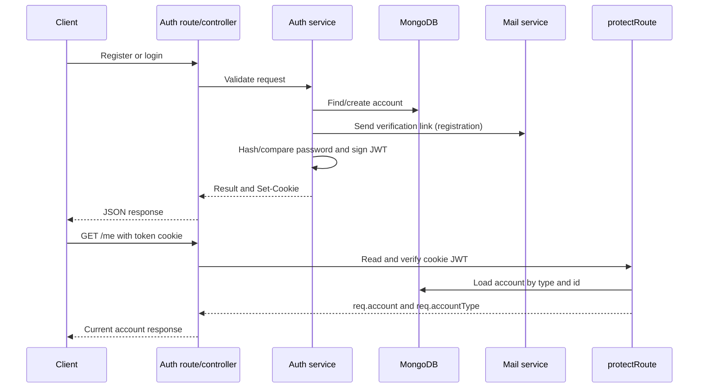

# Authentication

## Overview

RiderGO authenticates HTTP requests with a JWT stored in an HTTP-only cookie named `token`. The shared authentication middleware supports `User`, `Driver`, and `Admin` accounts. User authentication routes live under `/api/auth`; driver and admin registration/login routes live in their respective modules.

## Routes and flows

| Method | Path                            | Access           | Implemented behavior                                                                            |
| ------ | ------------------------------- | ---------------- | ----------------------------------------------------------------------------------------------- |
| `POST` | `/api/auth/register`            | Public           | Creates a User account and sends a verification email.                                          |
| `GET`  | `/api/auth/verify-email/:token` | Public           | Verifies a User or Driver email, deletes the used token, and sets an auth cookie.               |
| `POST` | `/api/auth/login`               | Public           | Logs in a verified User and sets an auth cookie.                                                |
| `POST` | `/api/auth/logout`              | Public           | Clears the auth cookie.                                                                         |
| `GET`  | `/api/auth/me`                  | Protected        | Returns the currently authenticated account through the auth controller's user-shaped response. |
| `POST` | `/api/drivers/register`         | Public           | Creates a Driver account with pending verification status.                                      |
| `POST` | `/api/drivers/login`            | Public           | Logs in a verified and approved Driver and sets an auth cookie.                                 |
| `POST` | `/api/drivers/logout`           | Protected Driver | Clears the auth cookie.                                                                         |
| `GET`  | `/api/drivers/me`               | Protected Driver | Returns the authenticated Driver.                                                               |
| `POST` | `/api/admin/register`           | Public           | Creates the first admin as `SUPER_ADMIN` and sets an auth cookie.                               |
| `POST` | `/api/admin/login`              | Public           | Logs in an active Admin and sets an auth cookie.                                                |
| `POST` | `/api/admin/logout`             | Protected Admin  | Clears the auth cookie.                                                                         |
| `GET`  | `/api/admin/me`                 | Protected Admin  | Returns the authenticated Admin.                                                                |

The `/api/auth` routes are registered by `app.ts`. Driver and admin routes are mounted separately by `app.ts`.

## User registration and login

`registerUser` requires `name`, `email`, and `password`. Missing values return `400`. An existing email returns `409`. The password is hashed with `bcrypt.hash(password, 10)` before the User document is saved. New users start with `isEmailVerified: false`; a verification email is then sent. The registration response is `201` and contains `success`, a message, and the new user's `id`, `name`, and `email`.

`loginUser` requires email and password. Missing values return `400`; an unknown email or failed bcrypt comparison returns `401` with the same invalid-credentials message. An unverified user receives `403`. Successful login generates a User JWT, sets the cookie, and returns `id`, `name`, `email`, and `isEmailVerified` with status `200`.

## Driver registration and login

Driver authentication is implemented in the driver module rather than through the user auth service. Registration requires `name`, `email`, `password`, `phone`, and `vehicleType`. Duplicate email returns `409`; the password is hashed and the new driver starts with `verificationStatus: "PENDING"`. Driver login requires valid credentials, a verified email, and a status other than `PENDING`. Unverified, pending, or rejected drivers receive `403`; rejected responses include the rejection reason. A successful driver login sets a Driver JWT cookie and returns driver identity, vehicle, verification, online, and blocked state data.

## Admin authentication

Admin registration requires `fullName`, `email`, and `password`. Registration is one-time: if any admin exists, it returns `409`. The first admin is created with role `SUPER_ADMIN` and receives a cookie. Admin login returns `401` for invalid credentials and `403` for an inactive admin; successful login updates `lastLogin` and returns identity, role, and active state. The admin password is excluded by default from the model query and is explicitly selected for login.

## Email verification

The email-verification service generates a 32-byte cryptographically random token and stores its hex representation. Before storing a new token, it deletes previous verification records for that account. The record stores the account identifier, `accountType`, token, and an expiry 15 minutes in the future. The email link is built from `APP_URL` and `/api/auth/verify-email/:token`.

Verification looks up the token, rejects an absent token with `400`, removes an expired record and returns `400`, then loads either a User or Driver based on the stored account type. A missing account returns `404`. On success it marks `isEmailVerified`, saves the account, deletes the verification record, generates the account-type JWT, sets the auth cookie, and returns the account identity with status `200`.

The standalone `emailVerification.routes.ts` file is empty; the active verification endpoint is the auth route above. The verification model's `user` reference metadata names `User` even for Driver records, although the service explicitly selects `DriverModel` for Driver tokens.

## JWTs and cookies

`generateToken` signs this application payload:

```ts
{
  accountId: string;
  accountType: "User" | "Driver" | "Admin";
}
```

The token is signed with `JWT_SECRET` and expires according to `JWT_EXPIRES_IN`. `verifyToken` verifies the token with the same secret. The token is set as the `token` cookie with these options:

| Option     | Current implementation                       |
| ---------- | -------------------------------------------- |
| `httpOnly` | `true`                                       |
| `secure`   | `true` only when `NODE_ENV === "production"` |
| `sameSite` | `"strict"`                                   |
| `maxAge`   | Seven days                                   |

Logout calls `clearAuthCookie`, which clears the same cookie attributes. Logout does not revoke a JWT server-side; it removes the browser cookie.

## Authentication middleware

`protectRoute` reads `req.cookies.token`. With no cookie it forwards `AppError("Unauthorized", 401)`. It verifies the JWT, selects User, Driver, or Admin according to `accountType`, and loads the account by `accountId`. An unknown account type returns `401`; a missing account returns `404`. It attaches the loaded document as `req.account` and the decoded type as `req.accountType` before calling `next()`.

Invalid or expired JWT exceptions from `verifyToken` are not converted to `AppError` in `protectRoute`. Based on the current generic error middleware, those exceptions can become an HTTP `500` response rather than a normalized `401`. This is the observed implementation behavior, not an intended contract.

## Authentication flow



## Security characteristics confirmed in code

- Passwords are stored as bcrypt hashes; the user and driver registration services hash before saving, and login uses bcrypt comparison.
- JWT secrets and payment/email/cloud credentials are supplied through environment variables rather than source literals.
- The auth cookie is HTTP-only and uses strict same-site behavior; it is secure in production.
- Verification tokens are random, time-limited, replaced per account, and deleted after successful verification.
- Email verification is required before User login and Driver login.
- Driver login additionally requires non-pending verification status.

The current code does not confirm JWT revocation, token rotation, rate limiting, brute-force protection, CSRF protection, or password-reset functionality. These should not be assumed to exist.
