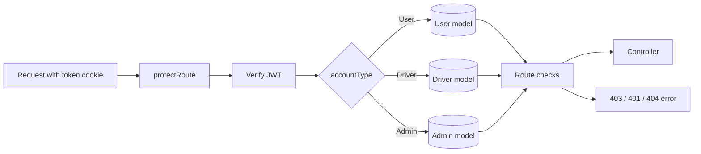

# Authorization

## Account types

The JWT account type is one of `User`, `Driver`, or `Admin`. `protectRoute` uses that claim to decide which Mongoose model to load and stores the result in `req.account` and `req.accountType`. Authentication proves account identity; the route middleware below applies access restrictions.

## Authorization middleware

| Middleware                        | Behavior                                                                                                                    |
| --------------------------------- | --------------------------------------------------------------------------------------------------------------------------- |
| `protectRoute`                    | Requires the `token` cookie, verifies the JWT, loads the account for its type, and attaches it to the request.              |
| `authorize(accountTypes, roles?)` | Requires `protectRoute` to have set an allowed account type; when a role list is supplied, it can also check an Admin role. |
| `adminOnly`                       | Allows only requests with `req.accountType === "Admin"`. It does not check admin role or `isActive`.                        |
| `requireSuperAdmin`               | Checks that the authenticated account is an Admin whose role is `SUPER_ADMIN`. No current route usage is confirmed.         |
| `ensureUserIsActive`              | For User requests, rejects blocked users and includes the stored block reason when present.                                 |
| `ensureDriverIsActive`            | Rejects a blocked Driver. It only applies on routes that explicitly include it.                                             |

The middleware is compositional: a route may use `protectRoute`, then an account-type or active-account check. `authorize` does not itself load an account.

## Route access matrix

The following reflects the route middleware currently present.

| Area                                 | User                                    | Driver                                                          | Admin                                   | Public routes/notes                                                                                            |
| ------------------------------------ | --------------------------------------- | --------------------------------------------------------------- | --------------------------------------- | -------------------------------------------------------------------------------------------------------------- |
| Auth registration/login/verification | Registration/login/verification         | Registration/login/verification                                 | Registration/login                      | Logout is public in the user auth router; driver/admin logout is protected by account type.                    |
| User profile                         | `protectRoute` + active User check      | No                                                              | No                                      | Profile routes use `protectRoute` and `ensureUserIsActive`; they do not explicitly call `authorize(["User"])`. |
| Driver profile/location/images       | No                                      | Driver authorization; active check is explicit on location only | No                                      | Driver profile/image routes use Driver authorization, but several do not use `ensureDriverIsActive`.           |
| Rides                                | Create, history, cancellation           | Accept/reject, arrival, OTP, start/complete, cancellation       | No                                      | Ride details allow User or Driver.                                                                             |
| Reviews                              | Create and user review access           | Create and public driver review access                          | Admin review management                 | Public driver review listing and summaries do not require authentication.                                      |
| Payments                             | Authenticated; controllers require User | No                                                              | No                                      | Payment controllers further enforce User accounts.                                                             |
| Appeals                              | No                                      | Create                                                          | List/review                             | Appeal administration is Admin-only.                                                                           |
| Business settings                    | No                                      | No                                                              | `adminOnly`                             | Admin-only access is account type based.                                                                       |
| Admin operations                     | No                                      | No                                                              | `protectRoute` + `authorize(["Admin"])` | Includes account management, driver verification, blocking, and review management.                             |

The ride, review, payment, appeal, and business-settings details are implemented in their own modules. This matrix summarizes their route-level middleware rather than replacing their module documentation.

## Active, blocked, and approved states

User profile routes call `ensureUserIsActive`, which checks `isBlocked`. Driver location uses `ensureDriverIsActive`; driver profile and image routes do not visibly include that middleware, so blocked-driver enforcement on those routes is not confirmed. Admin routes use `adminOnly` or `authorize(["Admin"])`; the current route declarations do not add an active-admin check or a role restriction.

Driver login checks both email verification and driver verification status. A pending driver is denied, and a rejected driver is denied with its rejection reason. This is a login business rule rather than a general authorization middleware.

Although `requireSuperAdmin.middleware.ts` implements a `SUPER_ADMIN` role check, no current route imports it. Super-admin-only endpoint enforcement is therefore not confirmed.

## Errors

Known authorization errors use `AppError` and are returned by the error middleware in the form `{ success: false, message }`:

| Condition                                       | Status from implementation |
| ----------------------------------------------- | -------------------------: |
| Missing auth cookie                             |     `401` (`Unauthorized`) |
| Invalid account type                            |                      `401` |
| Account document not found                      |                      `404` |
| Blocked User/Driver on an active-account route  |                      `403` |
| Account type rejected by `authorize`            |                      `403` |
| Non-admin rejected by `adminOnly`               |                      `403` |
| Non-super-admin rejected by `requireSuperAdmin` |                      `403` |

JWT verification exceptions are not wrapped by `protectRoute`; the generic error path can therefore produce `500` for an invalid or expired token. This is not a normalized unauthorized response in the current implementation.

## Authorization flow

## Not confirmed

The code does not confirm a formal permission/claim system beyond account type and the Admin role checks described above. It also does not confirm rate limiting, CSRF protection, a server-side session denylist, or automatic invalidation of cookies after an account is blocked.
