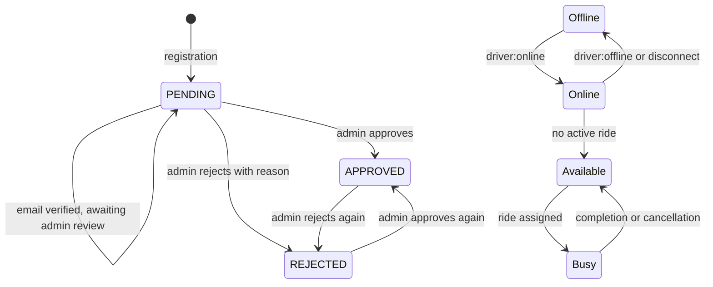

# Driver Module

## Responsibility

The Driver module manages driver accounts, verification data, presence, vehicle information, location, and driver-owned profile assets. It is mounted at `/api/drivers`. Driver ride actions are implemented in the Ride module and use the Driver model.

## Driver model

`driver.model.ts` defines a timestamped Mongoose model named `Driver`.

| Field                                                | Definition and current use                                                  |
| ---------------------------------------------------- | --------------------------------------------------------------------------- |
| `name`                                               | Required, trimmed string.                                                   |
| `email`                                              | Required, unique, trimmed string.                                           |
| `password`                                           | Required string; registration stores a bcrypt hash.                         |
| `phone`                                              | Required, trimmed string.                                                   |
| `profileImage`, `profileImagePublicId`               | Cloudinary URL and public ID for the profile image.                         |
| `isEmailVerified`                                    | Boolean, default `false`.                                                   |
| `verificationStatus`                                 | `PENDING`, `APPROVED`, or `REJECTED`; defaults to `PENDING`.                |
| `rejectionReason`                                    | Text recorded when an admin rejects verification.                           |
| `approvedAt`, `verifiedBy`                           | Approval timestamp and Admin reference.                                     |
| `isBlocked`, `blockReason`, `blockedAt`, `blockedBy` | Blocking state, reason, timestamp, and Admin reference.                     |
| `isOnline`                                           | Presence state, default `false`.                                            |
| `isAvailable`                                        | Whether the driver can receive a ride offer, default `false`.               |
| `vehicleType`                                        | Required enum: `Bike`, `Auto`, or `Car`.                                    |
| `licenseImage`, `licenseImagePublicId`               | License image URL and Cloudinary public ID.                                 |
| `rcImage`, `rcImagePublicId`                         | RC image URL and Cloudinary public ID.                                      |
| `vehicleImage`, `vehicleImagePublicId`               | Vehicle image URL and Cloudinary public ID.                                 |
| `currentLocation`                                    | GeoJSON `Point`, coordinates as `[longitude, latitude]`, and `lastUpdated`. |
| `pendingPenalty`                                     | Number, default `0`, minimum `0`.                                           |
| `averageRating`, `totalRatings`                      | Rating aggregates, default `0`; average is constrained to `0`-`5`.          |
| `createdAt`, `updatedAt`                             | Mongoose timestamps.                                                        |

Indexes cover `currentLocation` (`2dsphere`), `isAvailable + vehicleType`, and `isOnline + isAvailable`.

## Routes

| Method  | Endpoint                     | Middleware                                                   | Behavior                                                       |
| ------- | ---------------------------- | ------------------------------------------------------------ | -------------------------------------------------------------- |
| `POST`  | `/api/drivers/register`      | Public                                                       | Creates a pending Driver account and sends verification email. |
| `POST`  | `/api/drivers/login`         | Public                                                       | Authenticates a verified, non-pending, non-rejected Driver.    |
| `POST`  | `/api/drivers/logout`        | `protectRoute`, `authorize(["Driver"])`                      | Clears the auth cookie.                                        |
| `GET`   | `/api/drivers/me`            | `protectRoute`, `authorize(["Driver"])`                      | Returns the current Driver.                                    |
| `GET`   | `/api/drivers/profile`       | `protectRoute`, `authorize(["Driver"])`                      | Returns the Driver profile.                                    |
| `PATCH` | `/api/drivers/profile`       | `protectRoute`, `authorize(["Driver"])`                      | Updates `name` and `phone`.                                    |
| `PATCH` | `/api/drivers/location`      | `protectRoute`, Driver authorization, `ensureDriverIsActive` | Updates the GeoJSON location.                                  |
| `PATCH` | `/api/drivers/profile-image` | `protectRoute`, Driver authorization, Multer                 | Replaces the profile image.                                    |
| `PATCH` | `/api/drivers/license-image` | `protectRoute`, Driver authorization, Multer                 | Replaces the license image.                                    |
| `PATCH` | `/api/drivers/rc-image`      | `protectRoute`, Driver authorization, Multer                 | Replaces the RC image.                                         |
| `PATCH` | `/api/drivers/vehicle-image` | `protectRoute`, Driver authorization, Multer                 | Replaces the vehicle image.                                    |

Controllers in `driver.controller.ts` wrap requests with `asyncHandler` and delegate to `driver.service.ts`. `driver.image.service.ts` centralizes replacement of a selected image field and its Cloudinary public ID.

## Registration and login

Registration requires `name`, `email`, `password`, `phone`, and `vehicleType`. Missing values return `400` with `All fields are required`; a duplicate email returns `409`. The password is hashed with bcrypt cost `10`. The new Driver starts with `isEmailVerified: false` and `verificationStatus: "PENDING"`, then receives a verification email. The response is `201` and includes identity, phone, and vehicle type.

Login requires email and password. Missing values return `400`; an unknown email or failed bcrypt comparison returns `401` with `Invalid email or password`. An unverified email returns `403` with `Please verify your email first`. A pending driver receives `403` with `Your account is under review`; a rejected driver receives `403` with its rejection reason. Since the enum has only three values, successful approval is effectively required. Successful login signs a Driver JWT and sets the shared `token` cookie.

Email verification is shared with User authentication. A 32-byte random hex token is stored for 15 minutes, and the verification endpoint marks the Driver verified, deletes the token, and sets a Driver JWT cookie. The verification endpoint is `/api/auth/verify-email/:token`.

## Approval, rejection, and blocking

Admin operations update `verificationStatus` between `PENDING`, `APPROVED`, and `REJECTED`. Approval records `approvedAt` and `verifiedBy`; rejection requires a nonblank reason and clears approval metadata. Repeating the current status returns `400`.

Blocking stores `isBlocked`, `blockReason`, `blockedAt`, and `blockedBy`. Admin blocking requires a reason of at least 10 characters. Unblocking clears the block metadata. `ensureDriverIsActive` returns `403` for a blocked Driver.

The active-account check is route-specific. Driver ride lifecycle routes and location use `ensureDriverIsActive`. Driver profile and image routes use Driver authorization but do not include that middleware, so blocked-driver enforcement on those routes is not confirmed. Driver login checks verification state but does not visibly reject `isBlocked`.

## Profile and vehicle information

The profile endpoint returns identity, phone, vehicle type, profile image, email verification, verification status, online status, and blocked status. Profile updates require nonblank `name` and `phone`; names are trimmed and limited to 100 characters. Email, vehicle type, approval status, and blocking state are not editable through this route.

The vehicle type is constrained by the model to `Bike`, `Auto`, or `Car`. It is included in driver responses and ride offers. The current driver-matching query does not filter by vehicle type, despite the Driver index containing that field; this is an implementation behavior, not a documented guarantee of type-specific matching.

## Image handling

Each image route expects one multipart file with its route-specific field name. Shared Multer middleware stores the file in memory, accepts only MIME types beginning with `image/`, and limits files to 5 MB. Missing files return `400` with a field-specific message.

The image service deletes the previous Cloudinary asset when a public ID exists, uploads the replacement buffer with `resource_type: "image"`, and saves the returned `secure_url` and `public_id`. Current folders are:

| Image   | Cloudinary folder                |
| ------- | -------------------------------- |
| Profile | `ridergo/drivers/profile-images` |
| License | `ridergo/drivers/license-images` |
| RC      | `ridergo/drivers/rc-images`      |
| Vehicle | `ridergo/drivers/vehicle-images` |

Cloudinary or database failures are not converted into Driver-specific error messages by the service.

## Presence, availability, and location

`isOnline` and `isAvailable` are independent fields. Socket handlers implement the presence changes:

- `driver:online` sets `isOnline` to `true`; it sets `isAvailable` to `true` only when the driver has no active ride.
- `driver:offline` sets both fields to `false`.
- Socket disconnect sets both fields to `false`.
- Ride completion, user cancellation after assignment, and driver cancellation restore availability to `true`.

The HTTP location route validates latitude `-90..90` and longitude `-180..180`, then stores a GeoJSON Point as `[longitude, latitude]` with `lastUpdated`. It does not change online or availability state. The socket location handler updates location without the same coordinate-range validation.

When a driver disconnects with an active ride, the socket code emits `driver:disconnected` to the rider. Socket connections are tracked in a process-local in-memory store; cross-process presence is not confirmed.

## Driver ride and payment data

Driver-specific ride operations are under `/api/rides`, not `/api/drivers`: viewing the active driver ride, accepting/rejecting offers, arrival, OTP verification, start, completion, driver cancellation, and driver history. These routes require Driver authorization, and lifecycle actions use `ensureDriverIsActive`.

The Driver model stores `pendingPenalty`, `averageRating`, and `totalRatings`. Driver cancellation increments `pendingPenalty`; the current code does not confirm a collection or settlement workflow for that amount. Driver earnings, payout records, or driver-owned payment endpoints are not confirmed in the current codebase. Cash payment is marked paid when a ride completes, while online payment is handled by the payment module against the rider-owned ride.

## State transitions and business rules

The diagram combines independent verification and presence/availability fields; they are not one single enum in the model. A Driver must verify email and pass approval checks before login. A Driver must be online, available, approved, email-verified, and within the configured search radius to be returned by matching. Vehicle-type filtering is not applied by the current query.

## Error handling

Confirmed Driver-specific validation errors include missing registration fields (`400`), duplicate email (`409`), invalid credentials (`401`), unverified/pending/rejected login (`403`), blank profile values (`400`), overlong name (`400`), invalid coordinates (`400`), missing images (`400`), and blocked-driver rejection (`403`) on routes using `ensureDriverIsActive`. Known errors use `{ success: false, message }` through the shared error middleware. Exact output for raw Mongoose, Multer, Cloudinary, or socket failures is not confirmed.
