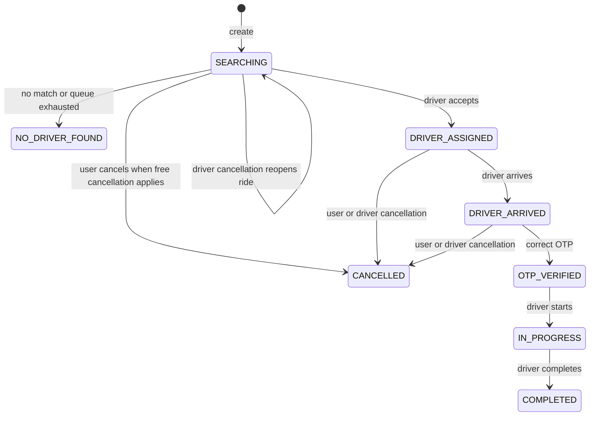

# Ride Module

## Responsibility and routes

The Ride module is mounted at `/api/rides`. Every route first uses `protectRoute`; route-level account and active-state middleware then restricts the operation.

| Method  | Endpoint                           | Account        | Operation                                      |
| ------- | ---------------------------------- | -------------- | ---------------------------------------------- |
| `POST`  | `/api/rides`                       | User           | Create a ride.                                 |
| `GET`   | `/api/rides/driver`                | Driver         | Get the driver's active ride.                  |
| `GET`   | `/api/rides/history`               | User           | List rider history.                            |
| `GET`   | `/api/rides/driver/history`        | Driver         | List driver history.                           |
| `GET`   | `/api/rides/:rideId`               | User or Driver | Get details after ownership/assignment checks. |
| `PATCH` | `/api/rides/:rideId/arrived`       | Driver         | Mark arrival.                                  |
| `PATCH` | `/api/rides/:rideId/verify-otp`    | Driver         | Verify the ride OTP.                           |
| `PATCH` | `/api/rides/:rideId/accept`        | Driver         | Accept a pending offer.                        |
| `PATCH` | `/api/rides/:rideId/reject`        | Driver         | Reject a pending offer.                        |
| `PATCH` | `/api/rides/:rideId/start`         | Driver         | Start after OTP verification.                  |
| `PATCH` | `/api/rides/:rideId/complete`      | Driver         | Complete an in-progress ride.                  |
| `PATCH` | `/api/rides/:rideId/cancel`        | User           | Cancel under rider cancellation rules.         |
| `PATCH` | `/api/rides/:rideId/driver-cancel` | Driver         | Cancel under driver cancellation rules.        |

Controllers in `ride.controller.ts` delegate to `ride.service.ts`. Dispatch and offer operations are delegated to the shared dispatch service and `rideOffer` module.

## Ride model

`ride.model.ts` defines a timestamped `Ride` document.

| Field                    | Definition                                                                       |
| ------------------------ | -------------------------------------------------------------------------------- |
| `rider`                  | Required User ObjectId reference.                                                |
| `driver`                 | Nullable Driver ObjectId reference.                                              |
| `pickup`, `destination`  | Required subdocuments containing trimmed `address`, `latitude`, and `longitude`. |
| `vehicleType`            | Required enum: `Bike`, `Auto`, or `Car`.                                         |
| `fare`                   | Required nonnegative number.                                                     |
| `distance`               | Required nonnegative route distance, stored in kilometers.                       |
| `duration`               | Required nonnegative route duration, stored in minutes.                          |
| `status`                 | Ride lifecycle enum listed below.                                                |
| `dispatch`               | Queue, current driver index, completion flag, and dispatch lock flag.            |
| `otp`                    | Hash while active; cleared after successful verification.                        |
| `paymentMethod`          | Required `Cash`, `UPI`, or `Card`.                                               |
| `paymentStatus`          | `PENDING`, `PAID`, or `FAILED`; defaults to `PENDING`.                           |
| `cancelledBy`            | `User`, `Driver`, or `Admin`, default `null`.                                    |
| `cancellationFee`        | Nonnegative number, default `0`.                                                 |
| `cancellationReason`     | Trimmed string, default empty.                                                   |
| `cancelledAt`            | Cancellation timestamp or `null`.                                                |
| `createdAt`, `updatedAt` | Mongoose timestamps.                                                             |

Indexes support rider and driver history, active ride lookups, and status queries.

## Ride creation

The service explicitly requires `pickup`, `destination`, `vehicleType`, and `paymentMethod`; missing values produce `400` with `All fields are required`. It then calls the Google Routes service, stores distance in kilometers and duration in minutes, calculates fare from BusinessSettings, generates a six-digit OTP, hashes it with bcrypt, creates the ride in `SEARCHING`, dispatches it, and returns the result.

The plain OTP is currently logged as `Ride OTP: <plainOtp>` in the service and is marked for removal in source. It is not included as a normal persisted field after hashing. Maps errors include `Failed to calculate route.`, `No route found.`, and `Invalid route duration received.`; these generic errors reach the generic error path. No request-validation library is used.

## Pricing and vehicle selection

The requested vehicle type selects the corresponding BusinessSettings pricing values. The base formula is:

```text
baseFare + distance * perKm + duration * perMinute
```

Enabled peak-hour and traffic multipliers are applied and the final result is rounded. Ride vehicle type is stored and included in offers. However, `findNearbyDrivers` currently queries online, available, approved, email-verified drivers by location and does not pass or filter `vehicleType`; the current implementation therefore does not enforce vehicle-specific driver matching.

## Lifecycle statuses

| Status            | Meaning and transitions in current code                                                                    |
| ----------------- | ---------------------------------------------------------------------------------------------------------- |
| `SEARCHING`       | Initial state and state reopened after a successful driver cancellation. Dispatch is looking for a driver. |
| `NO_DRIVER_FOUND` | No eligible nearby driver was found or the queue was exhausted.                                            |
| `DRIVER_ASSIGNED` | A driver accepted and was assigned.                                                                        |
| `DRIVER_ARRIVED`  | Assigned driver marked arrival.                                                                            |
| `OTP_VERIFIED`    | Assigned driver submitted the correct OTP.                                                                 |
| `IN_PROGRESS`     | Assigned driver started after OTP verification.                                                            |
| `COMPLETED`       | Assigned driver completed the ride.                                                                        |
| `CANCELLED`       | User or driver cancellation succeeded.                                                                     |

The normal path is:

```text
SEARCHING -> DRIVER_ASSIGNED -> DRIVER_ARRIVED -> OTP_VERIFIED -> IN_PROGRESS -> COMPLETED
```

## Driver assignment and arrival

An accepted offer calls `assignRideToDriver`. It requires the ride to be `SEARCHING` and without a driver; otherwise it returns `409` (`Ride is no longer available` or `Ride already has a driver`). It sets the driver, changes status to `DRIVER_ASSIGNED`, marks the Driver unavailable, and expires all pending offers for the ride.

Arrival requires an assigned driver matching the request account and status `DRIVER_ASSIGNED`. It changes status to `DRIVER_ARRIVED` and emits `ride:driver-arrived`. Repeated arrival returns `400`.

## OTP, start, and completion

OTP verification requires the assigned matching Driver and status `DRIVER_ARRIVED`. The submitted value is compared with the bcrypt hash. A missing arrival state returns `400`; an invalid OTP returns `400`. Success changes status to `OTP_VERIFIED`, clears the stored OTP, and emits `ride:otp-verified`.

Start requires the matching assigned Driver and `OTP_VERIFIED`; otherwise it returns `400` with `OTP verification is required`. Success changes status to `IN_PROGRESS` and emits `ride:started`.

Completion requires the matching assigned Driver and `IN_PROGRESS`; otherwise it returns `400` with `Ride is not in progress`. Success changes status to `COMPLETED`, makes cash rides `paymentStatus: "PAID"`, restores driver availability, and emits `ride:completed`. Online rides remain `PENDING` until payment verification or webhook processing. No driver earnings calculation is confirmed here.

## Payment status

Every ride starts with `paymentStatus: "PENDING"`. Cash completion sets it to `PAID`. UPI/Card payment creation is handled after completion by the payment module, which verifies Razorpay signatures and then marks the ride paid. `FAILED` exists in the enum, but the exact ride-level transition into that value is not confirmed in the inspected ride lifecycle code.

## History and details

User history filters by `rider` and driver history by `driver`, both newest first. History includes route data, vehicle type, fare, distance, duration, payment method/status, status, and `createdAt`, but not cancellation metadata. Ride details include rider/driver IDs, route and fare data, payment fields, status, cancellation actor/fee/reason/time, and timestamps. A cancelled ride after driver assignment clears `driver`, so it no longer matches that driver's history query.

## Lifecycle diagram



The normal lifecycle does not confirm cancellation from `OTP_VERIFIED`, `IN_PROGRESS`, or `COMPLETED`; the current cancellation branches allow the pre-start assigned/arrived states described above.

## Validation and race handling

Route-level account and active-state middleware protect ride actions. Services also check ride existence, assignment, requester ownership, current status, and matching driver identity. Offer accept/reject uses an atomic pending-offer update. Dispatch-next uses a conditional per-ride `isDispatchInProgress` lock.

Arrival, OTP verification, start, completion, and assignment use read/mutate/save or separate updates rather than a single transaction. Assignment's ride update and Driver availability update are separate operations. Cancellation includes a conditional rider update and a `409` state-change response, but driver cancellation mutates penalty/availability before the conditional ride update. These are the current race and consistency boundaries; stronger atomicity is not confirmed.
