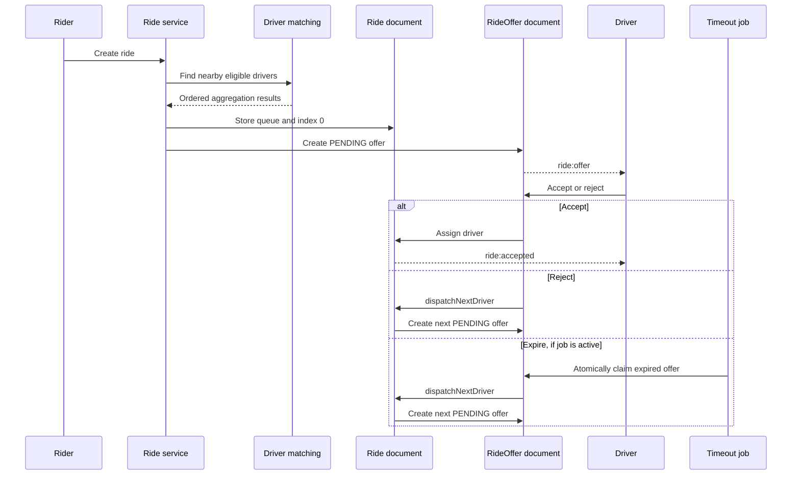

# Dispatch System

## Overview

Dispatch is implemented by `services/dispatch.service.ts`, with driver selection in `services/driverMatching.service.ts` and offers in the `rideOffer` module. The algorithm is sequential: one driver receives an offer at a time, and the next queue entry is offered after rejection or expiration.

## Selecting drivers

`findNearbyDrivers` uses MongoDB `$geoNear` around the ride pickup point. Coordinates are passed as `[longitude, latitude]`. Unless a distance is explicitly supplied, it reads `BusinessSettings.driverMatching.searchRadius`.

The query requires:

- `isOnline: true`
- `isAvailable: true`
- `verificationStatus: "APPROVED"`
- `isEmailVerified: true`

The result includes MongoDB's calculated distance. Although the Driver model has a vehicle-type index, the current matching call does not provide the ride's vehicle type and the query does not filter it. Vehicle-compatible matching is therefore not implemented in this path.

## Queue construction

When a ride is created in `SEARCHING`, `dispatchRide` builds the queue. If no nearby driver is returned, it sets `status: "NO_DRIVER_FOUND"` and `dispatch.isDispatchCompleted: true`. Otherwise it stores the returned Driver IDs in `dispatch.queue`, resets `currentDriverIndex` to `0`, sets dispatch incomplete, and offers the first driver.

The Ride dispatch subdocument contains:

| Field                  | Purpose                                                |
| ---------------------- | ------------------------------------------------------ |
| `queue`                | Ordered Driver ObjectId queue.                         |
| `currentDriverIndex`   | Current queue position.                                |
| `isDispatchCompleted`  | Stops further dispatch after completion or exhaustion. |
| `isDispatchInProgress` | Per-ride dispatch lock used by next-driver processing. |

## Ride offers

An offer contains `ride`, `driver`, `status`, `offeredAt`, `respondedAt`, `expiresAt`, and timestamps. Offer statuses are `PENDING`, `ACCEPTED`, `REJECTED`, and `EXPIRED`. A unique `(ride, driver)` index prevents the same driver from receiving another offer for the same ride.

The service currently sets `expiresAt` to ten seconds after creation. `RIDE_OFFER_TIMEOUT` is validated and exported but is not consumed by the active offer service. The offer event is emitted to the Driver's Socket.IO room and includes ride ID, rider ID, pickup/destination, vehicle type, fare, distance, and duration.

## Accept and reject

Accepting an offer uses an atomic `findOneAndUpdate` requiring the specific ride, driver, and `status: "PENDING"`. This compare-and-set behavior prevents two ordinary responses from accepting the same offer. On success, assignment checks that the ride is still `SEARCHING` and has no driver, assigns the Driver, makes the Driver unavailable, expires all pending offers, and emits the acceptance event.

Rejecting also atomically changes only a matching pending offer and then dispatches the next Driver. Missing offers return `404`; an unavailable offer returns `409` for acceptance. Rejection returns success when the state transition occurs.

The lookup and state transition do not check `expiresAt`. If an offer remains `PENDING` after its timestamp, it can still be accepted or rejected until expiration processing changes its status.

## Next-driver algorithm

`dispatchNextDriver` claims a ride with a conditional update requiring:

```text
status = SEARCHING
dispatch.isDispatchCompleted = false
dispatch.isDispatchInProgress = false
```

It sets `isDispatchInProgress: true`. If the queue is exhausted, it changes the ride to `NO_DRIVER_FOUND`, marks dispatch complete, and clears the lock. Otherwise it increments `currentDriverIndex`, saves the ride, creates an offer for that Driver, and clears the lock in `finally`.

This lock prevents ordinary concurrent next-driver operations from advancing the same ride simultaneously. Assignment is not protected by the same atomic conditional update; the ride and Driver updates are separate operations.

## Expiration job

`jobs/rideOfferTimeout.job.ts` repeatedly claims one expired pending offer, marks it `EXPIRED`, and calls `dispatchNextDriver` for that ride. `claimExpiredRideOffer` provides the atomic claim boundary, so two job iterations should not process the same pending offer through that claim.

The job is not started by normal `server.ts` startup because `startRideOfferTimeoutJob()` is commented out. If started manually, its polling interval is `RIDE_OFFER_JOB_INTERVAL`. Therefore automatic expiration and next-driver progression are not active in the standard development/production commands.

## Dispatch sequence



## Confirmed limitations

The current code does not confirm parallel/broadcast dispatch, vehicle-type filtering, a distributed queue, active timeout processing at startup, use of `RIDE_OFFER_TIMEOUT`, or transactionally atomic assignment of Ride and Driver state. An expired timestamp alone does not make an offer unusable until the expiration job changes its status.
