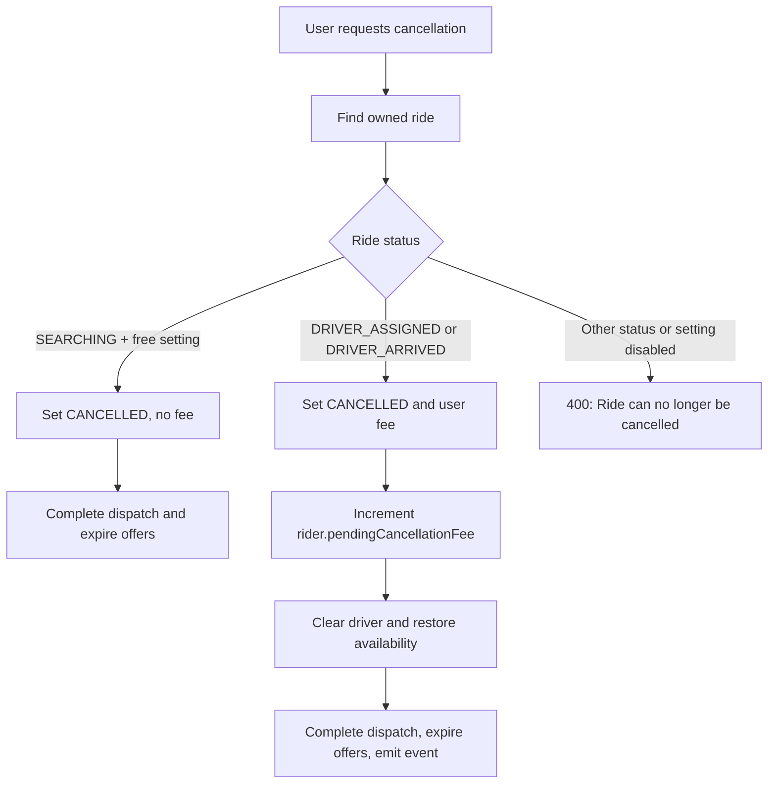
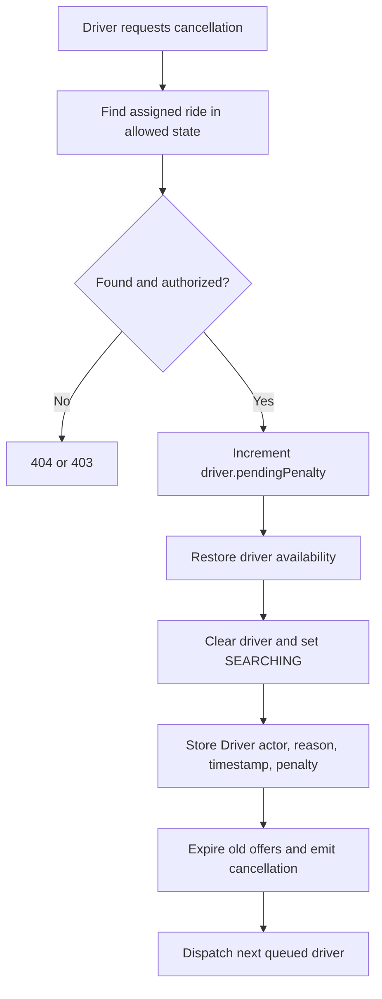

# Cancellation System

## Scope and data

Cancellation logic is in `modules/ride/ride.service.ts`. A Ride stores `cancelledBy`, `cancellationFee`, `cancellationReason`, and `cancelledAt`. The allowed `cancelledBy` values are `User`, `Driver`, and `Admin`, although no Admin cancellation route is confirmed.

BusinessSettings supplies:

| Setting                                            | Current role                                                    | Default |
| -------------------------------------------------- | --------------------------------------------------------------- | ------: |
| `cancellation.freeCancellationBeforeDriverAccepts` | Controls free User cancellation while `SEARCHING`.              |  `true` |
| `cancellation.userFee`                             | Fee applied when a User cancels after driver acceptance.        |    `20` |
| `cancellation.driverPenalty`                       | Penalty applied when a Driver cancels an assigned/arrived ride. |    `50` |

The cancellation request body is `{ reason: string }`. The service stores the value but does not explicitly validate presence, blank content, or length.

## Rider cancellation before acceptance

When the setting `freeCancellationBeforeDriverAccepts` is enabled and the ride is `SEARCHING`, a User can cancel without a fee. The service changes the ride to `CANCELLED`, records `cancelledBy: "User"`, the reason, and timestamp, marks dispatch complete, and expires pending offers. It does not increment a pending rider fee and does not emit a cancellation socket event in this branch.

The update is conditional. If the ride state changes before the update succeeds, the service returns `409` with `Ride state changed. Cancellation could not be completed.` If the setting is disabled, a `SEARCHING` ride does not enter this free branch and ultimately returns `400` with `Ride can no longer be cancelled`.

## Rider cancellation after acceptance

User cancellation is allowed for `DRIVER_ASSIGNED` and `DRIVER_ARRIVED`. On success the service:

1. Sets status to `CANCELLED`.
2. Clears `driver`.
3. Stores `cancelledBy: "User"`, reason, timestamp, and `settings.cancellation.userFee`.
4. Marks dispatch complete and expires pending offers.
5. Adds the fee to `rider.pendingCancellationFee`.
6. Restores the previously assigned Driver's availability.
7. Emits `ride:cancelled`.

The fee is recorded both on the Ride and the User's pending balance. A collection, payment, or settlement workflow for `pendingCancellationFee` is not confirmed.

## Driver cancellation

Driver cancellation is allowed only for `DRIVER_ASSIGNED` and `DRIVER_ARRIVED`, and the route requires the assigned Driver plus `ensureDriverIsActive`. The service adds `settings.cancellation.driverPenalty` to `driver.pendingPenalty`, restores availability, changes the ride back to `SEARCHING`, clears the driver, records `cancelledBy: "Driver"`, reason, timestamp, and penalty in `cancellationFee`, expires old offers, emits `ride:cancelled`, and dispatches the next Driver.

The pending penalty is stored on the Driver. No enforcement, deduction, payout, or collection workflow for it is confirmed.

## State and offer effects

| Cancellation actor        | Allowed ride status                 | Resulting status | Driver                     | Dispatch/offers                             |
| ------------------------- | ----------------------------------- | ---------------- | -------------------------- | ------------------------------------------- |
| User, free pre-acceptance | `SEARCHING`                         | `CANCELLED`      | None                       | Dispatch completed; pending offers expired. |
| User, after acceptance    | `DRIVER_ASSIGNED`, `DRIVER_ARRIVED` | `CANCELLED`      | Cleared and made available | Dispatch completed; pending offers expired. |
| Driver                    | `DRIVER_ASSIGNED`, `DRIVER_ARRIVED` | `SEARCHING`      | Cleared and made available | Old offers expired; next driver dispatched. |

Cancellation is not confirmed for `OTP_VERIFIED`, `IN_PROGRESS`, or `COMPLETED`. When a user cancellation clears the Driver, the cancelled Ride no longer appears in that Driver's history query because history filters by `driver`.

## Rider flow

## Driver flow

## Race-condition and consistency behavior

The User `SEARCHING` cancellation uses a conditional state update and explicitly returns `409` when the ride changes concurrently. Driver cancellation first mutates the Driver's penalty and availability, then performs the conditional ride update. If the ride update loses a race, those side effects may already have occurred.

Assignment, availability changes, offer expiration, and cancellation side effects are separate database operations; no transaction spanning Ride, Driver, User, and RideOffer is confirmed. Driver cancellation also reopens the ride, and later reassignment does not clear the prior cancellation metadata, so a subsequently assigned ride can still carry the previous cancellation actor, reason, timestamp, and fee.

## Errors and unconfirmed behavior

Known responses include `404` for a missing ride, `403` for an unauthorized assigned Driver, `400` when the status is not cancellable, and `409` for the confirmed User state-change race. The reason field is stored without explicit service-level validation. Admin cancellation, fee collection, penalty enforcement, cancellation after trip start, and transactional side-effect handling are not confirmed in the current codebase.
