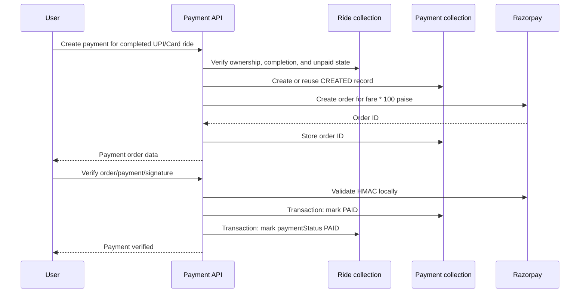

# Payment System

## Scope and model

Payment logic is in the payment module and is associated with a Ride and User. `payment.model.ts` defines a timestamped Payment document:

| Field               | Definition                                             |
| ------------------- | ------------------------------------------------------ |
| `ride`              | Required unique Ride reference.                        |
| `rider`             | Required User reference.                               |
| `amount`            | Required nonnegative number.                           |
| `currency`          | Required string, default `INR`.                        |
| `method`            | `Cash`, `UPI`, or `Card`.                              |
| `status`            | `CREATED`, `PAID`, or `FAILED`; defaults to `CREATED`. |
| `razorpayOrderId`   | Razorpay order ID, default empty.                      |
| `razorpayPaymentId` | Razorpay payment ID, default empty.                    |
| `razorpaySignature` | Stored verification signature, default empty.          |
| `paidAt`            | Payment timestamp or `null`.                           |

Indexes support rider history, Razorpay order ID, and Razorpay payment ID. The unique Ride field prevents multiple Payment documents for one Ride.

## Routes and authorization

The router is mounted at `/api/payments`:

| Method | Endpoint               | Access         | Behavior                                            |
| ------ | ---------------------- | -------------- | --------------------------------------------------- |
| `POST` | `/api/payments/`       | Protected User | Creates or returns an online payment order.         |
| `POST` | `/api/payments/verify` | Protected User | Verifies an online payment and marks the ride paid. |

Both routes use `protectRoute`; controllers additionally require `req.accountType === "User"`. Non-users receive `403` with `Only users can create payments.` or `Only users can verify payments.`

## Supported methods and statuses

Rides support `Cash`, `UPI`, and `Card`. Ride payment status is separate from Payment status:

| Record               | Values                      |
| -------------------- | --------------------------- |
| Ride `paymentStatus` | `PENDING`, `PAID`, `FAILED` |
| Payment `status`     | `CREATED`, `PAID`, `FAILED` |

Cash rides are marked `PAID` when the Driver completes the ride. UPI and Card payments remain pending until verification or webhook processing. The current code does not confirm a separate cash Payment document or cash collection endpoint.

## Creating an online payment

`createPayment(riderId, rideId)`:

1. Finds the Ride and confirms it belongs to the requesting User.
2. Rejects Cash rides.
3. Rejects a ride whose `paymentStatus` is already `PAID`.
4. Requires Ride status `COMPLETED`.
5. Reuses an existing non-paid Payment when one exists.
6. Otherwise creates a local `CREATED` Payment record.
7. Creates a Razorpay order for `ride.fare * 100` paise, currency `INR`, with receipt `ride_<rideId>`.
8. Stores the returned Razorpay order ID.

The success response contains payment ID, Ride ID, amount, currency, method, status, Razorpay order ID, and `RAZORPAY_KEY_ID`. Duplicate Payment creation is protected by the unique Ride index; duplicate-key handling reloads the existing record. If Razorpay order creation fails after the local record is inserted, cleanup or reconciliation is not confirmed.

## Payment verification

Verification finds the Payment by `razorpayOrderId`, checks rider ownership, loads the Ride, requires `COMPLETED`, and rejects already-paid records. It computes an HMAC-SHA256 digest over:

```text
razorpayOrderId + "|" + razorpayPaymentId
```

using `RAZORPAY_KEY_SECRET`. The supplied signature is compared with `crypto.timingSafeEqual`.

On success, a MongoDB transaction updates the Payment with Razorpay payment ID and signature, sets Payment status to `PAID`, sets `paidAt`, and sets Ride `paymentStatus` to `PAID`.

Confirmed errors include missing Payment (`404`), unauthorized rider (`403`), already verified (`400`), missing Ride (`404`), non-completed Ride (`400`), already-paid Ride (`400`), and invalid signature (`400`). Success returns `Payment verified successfully.` with the payment ID, Ride ID, and `paymentStatus: "PAID"`.

## Payment flow



## Error handling and boundaries

Known service errors use `{ success: false, message }` through the shared error middleware. Payment creation and verification require a User owner and completed Ride. Payment verification uses a transaction; payment creation, Razorpay order creation, and cross-system webhook processing have separate consistency boundaries.

Refunds, payouts, driver earnings, payment history routes, capture APIs, cash settlement, and payment-method switching are not confirmed in the current codebase.
