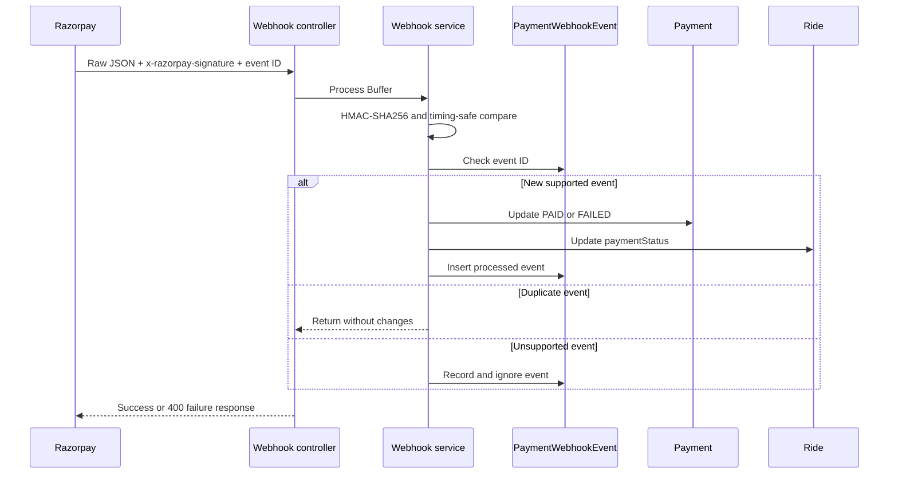

# Razorpay Webhook

## Endpoint and raw body

The webhook endpoint is:

```text
POST /api/payments/webhook
```

`app.ts` registers it before `express.json()` with `express.raw({ type: "application/json" })`. The request body must remain a Node.js `Buffer`; parsing it first would change the bytes used for signature verification. The route is not protected by the authentication cookie or account authorization middleware.

## Signature verification

`processRazorpayWebhook` computes HMAC-SHA256 over the raw request body with `RAZORPAY_WEBHOOK_SECRET`, converts the expected and received signatures to buffers, and compares them with `crypto.timingSafeEqual` after checking equal lengths.

The service rejects a missing signature, missing event ID, non-Buffer body, or invalid signature with `400`. The controller catches processing failures, logs them, and returns `400` with:

```json
{ "success": false, "message": "Webhook processing failed." }
```

## Event IDs and idempotency

`PaymentWebhookEvent` stores:

| Field         | Definition                            |
| ------------- | ------------------------------------- |
| `eventId`     | Required, unique, indexed identifier. |
| `event`       | Required event name.                  |
| `processedAt` | Defaults to the current time.         |
| timestamps    | Mongoose timestamps.                  |

The service first checks whether the event ID already exists and returns without processing when it does. Unsupported events are recorded and ignored. A unique index plus duplicate-key handling also protects concurrent event-ledger insertion.

## Supported events

| Event              | Payload identifier                                 | Payment update                                           | Ride update               |
| ------------------ | -------------------------------------------------- | -------------------------------------------------------- | ------------------------- |
| `payment.captured` | `payload.payment.entity.order_id`, plus payment ID | Payment `PAID`; `paidAt` set if empty; payment ID stored | `paymentStatus: "PAID"`   |
| `payment.failed`   | `payload.payment.entity.order_id`, plus payment ID | Payment `FAILED`; payment ID stored                      | `paymentStatus: "FAILED"` |
| `order.paid`       | `payload.order.entity.id`                          | Payment `PAID`; `paidAt` set if empty                    | `paymentStatus: "PAID"`   |

For a supported event, the service finds the local Payment by `razorpayOrderId`. Missing order IDs produce `400`; a missing local Payment produces `404` internally and is normalized by the controller.

The webhook handler does not store `razorpaySignature`. It updates the Payment and Ride before inserting the event ledger record.

## Processing flow



## Failure scenarios and limitations

The webhook service requires the raw body, signature, and event ID. Invalid JSON, missing payload identifiers, unknown local Payment records, database failures, and invalid signatures fail processing. The controller uses the same `400 Webhook processing failed.` response for all caught failures.

Payment/Ride updates and event-ledger insertion are not inside one MongoDB transaction. A process failure after Payment/Ride mutation but before ledger insertion can permit a later redelivery to repeat the updates. The initial duplicate check and final insert are also separate operations, though the unique index handles some races.

No replay queue, signature rotation, payload archive, refund-event handling, or webhook retry management is confirmed. The implementation provides event-ID deduplication with the consistency limitations above.
