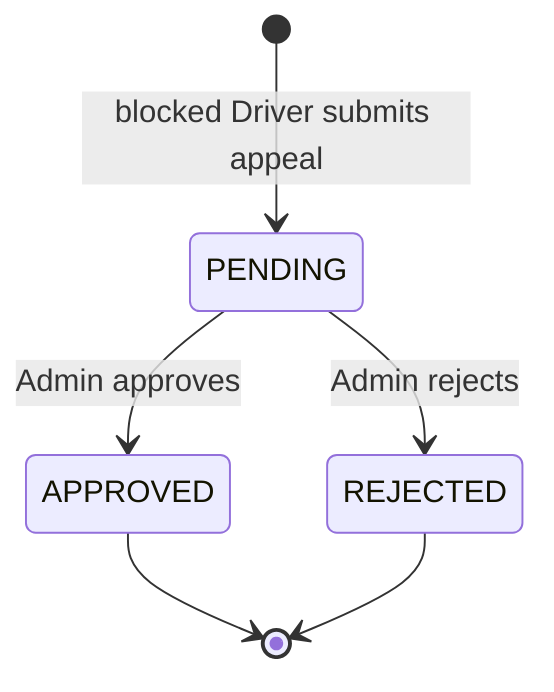

# Appeal Module

## Model

`appeal.model.ts` defines a timestamped Appeal:

| Field                 | Definition                                               |
| --------------------- | -------------------------------------------------------- |
| `driver`              | Required Driver reference.                               |
| `admin`               | Optional Admin reference, default `null`.                |
| `reason`              | Required, trimmed, maximum `1000` characters.            |
| `originalBlockReason` | Required trimmed snapshot, maximum `1000`.               |
| `blockedAtSnapshot`   | Optional snapshot date.                                  |
| `status`              | `PENDING`, `APPROVED`, or `REJECTED`; default `PENDING`. |
| `adminResponse`       | Trimmed response, maximum `1000`, default empty.         |
| `resolvedAt`          | Resolution timestamp or `null`.                          |
| timestamps            | Mongoose timestamps.                                     |

Indexes support Driver/status lookup, status/creation sorting, and Admin lookup.

## Routes and authorization

Mounted at `/api/appeals`:

| Method  | Endpoint                       | Access           | Behavior                                          |
| ------- | ------------------------------ | ---------------- | ------------------------------------------------- |
| `POST`  | `/api/appeals/`                | Protected Driver | Creates an appeal for the current blocked Driver. |
| `GET`   | `/api/appeals/admin`           | Protected Admin  | Lists appeals with filters and pagination.        |
| `PATCH` | `/api/appeals/admin/:appealId` | Protected Admin  | Approves or rejects an appeal.                    |

The declared Driver appeal-list response type exists, but no Driver list route or implementation is confirmed.

## Creation

Only a blocked Driver can create an appeal. The service requires an appeal reason of at least 10 characters and rejects an existing pending appeal for that Driver. Confirmed errors are `400` for an unblocked Driver or short reason and `409` for an existing pending appeal.

The new record snapshots the current `blockReason` and `blockedAt`, starts with `status: "PENDING"`, and belongs to the authenticated Driver.

## Admin listing

Admin listing supports `page` (default `1`), `limit` (default `20`), `status`, Driver search by name/email/phone, and descending `sortOrder` by default. Results include Driver identity, reason, original block snapshot, status, Admin response, creation time, and resolution time.

## Review and state transitions

Review requires a valid ObjectId, an unresolved appeal, a response of at least 10 characters, and an existing Driver. Invalid ID returns `400`; missing appeal or Driver returns `404`; already reviewed returns `400`; a short response returns `400`.

The service stores the Admin, response, selected status, and `resolvedAt`. Approval unblocks the Driver and clears block reason, timestamp, and Admin reference. Rejection leaves the Driver blocked. Appeal and Driver updates are separate saves without a transaction.

## Not confirmed

The code does not confirm appeal withdrawal, escalation, email notification, automatic re-blocking, a Driver-visible result endpoint, or transactional consistency between appeal resolution and Driver unblocking.
