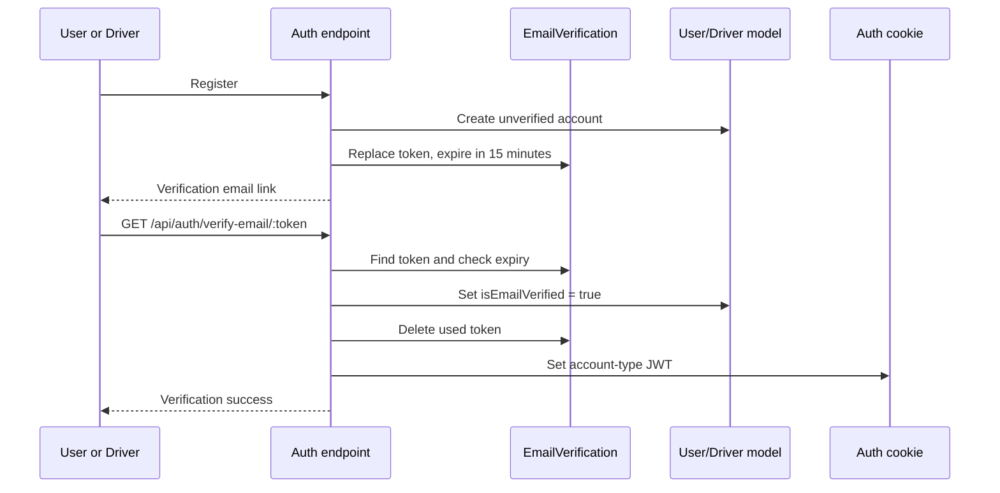

# Email Verification

## Overview

Email verification supports both User and Driver accounts. Registration in the auth and driver modules creates an unverified account and calls the shared email-verification service. The active verification endpoint is part of Auth; the standalone `emailVerification.routes.ts` and controller are empty.

## Verification model

`EmailVerification` is a timestamped document with:

| Field         | Definition                                                                                                                |
| ------------- | ------------------------------------------------------------------------------------------------------------------------- |
| `user`        | Required ObjectId. It references `User` in schema metadata, but stores Driver IDs as well when `accountType` is `Driver`. |
| `accountType` | Required `User` or `Driver`.                                                                                              |
| `token`       | Required unique string.                                                                                                   |
| `expiresAt`   | Required expiration date.                                                                                                 |
| timestamps    | Mongoose timestamps.                                                                                                      |

## Token creation and email

`sendVerificationEmail` generates a token with:

```text
crypto.randomBytes(32).toString("hex")
```

It deletes previous verification records for the account, stores the new account ID/type/token/expiry, and sets expiry to 15 minutes after creation. The verification link is:

```text
${APP_URL}/api/auth/verify-email/${token}
```

The email is sent using Nodemailer configured with `SMTP_HOST`, numeric `SMTP_PORT`, `SMTP_USER`, `SMTP_PASS`, and `SMTP_FROM`. The mail transport sets `secure: false`. The subject is `Verify your RiderGO account` and the body comes from the verification email template.

## Verification flow



`verifyUserEmail` rejects an absent token with `400 Invalid verification token`. Expired tokens are deleted and return `400 Verification token has expired`. It loads User or Driver according to the stored account type; a missing account returns `404`. Success marks `isEmailVerified`, saves the account, deletes the token, issues the corresponding JWT cookie, and returns the account identity with `Email verified successfully`.

## Cleanup

`server.ts` runs `cleanupExpiredVerificationUsers` every two minutes. For each expired record, cleanup loads the account using its stored type. If the account exists and remains unverified, cleanup deletes the account; it then deletes the verification record. Verified accounts are retained and their expired token is removed.

Cleanup is sequential, process-local, and non-transactional. It does not explicitly remove Cloudinary assets or other related records. Distributed cleanup coordination is not confirmed.

## Error and security boundaries

Registration hashes account passwords before saving and replaces previous verification records, limiting the normal account to one current token. Tokens are random, short-lived, unique, and deleted after successful verification. The auth cookie is HTTP-only, strict same-site, secure in production, and expires after seven days.

SMTP delivery failures are not converted into an email-specific response. An account and verification record may exist even when delivery fails, depending on where the failure occurs. The code does not confirm resend limits, token revocation lists, email-change verification, password reset, or a background queue for email delivery.
