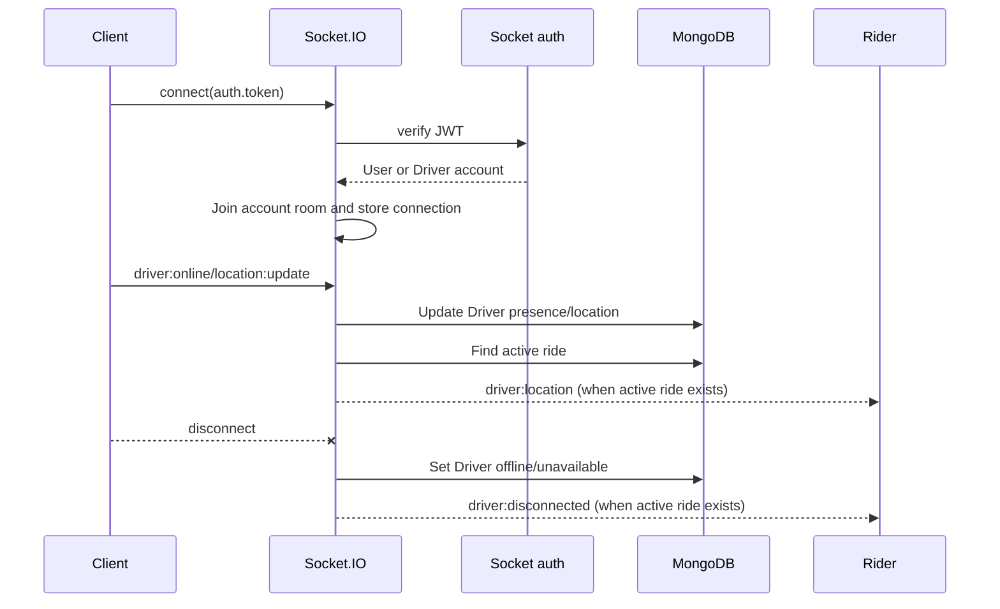

# Socket.IO Realtime

## Initialization and lifecycle

`server.ts` creates an HTTP server around the Express app and passes it to `initializeSocket`. `socket.ts` creates one Socket.IO server with CORS configured from `env.CLIENT_URL` and `credentials: true`.

On connection, the server authenticates the socket, stores the connection, joins an account room, and registers handlers. On disconnect it leaves the room, removes the connection if the stored socket ID matches, and logs the disconnect.

## Authentication and account types

Clients provide the HTTP JWT in `socket.handshake.auth.token`. `authenticateSocket` verifies it with the shared JWT secret. `User` and `Driver` are supported; Admin sockets throw `Admin socket is not supported` and are forcibly disconnected. Missing tokens throw `Authentication token is required`. Authentication failures are logged as `Socket authentication failed`.

Socket authentication does not use the HTTP cookie directly. It uses the token supplied in the Socket.IO handshake.

## Rooms and connected accounts

Authenticated accounts join exactly one room:

| Account type | Room                 |
| ------------ | -------------------- |
| User         | `User:<accountId>`   |
| Driver       | `Driver:<accountId>` |

`socketStore.ts` keeps a process-local `Map` keyed by account type and ID. A new connection replaces the previous entry. Removal checks the socket ID before deleting, so an old socket cannot remove a newer stored connection. The store is not shared between processes or server instances.

## Client-originated events

Only Driver sockets receive handlers from `registerSocketHandlers`.

| Event                    | Payload                                   | Behavior                                                                                           |
| ------------------------ | ----------------------------------------- | -------------------------------------------------------------------------------------------------- |
| `driver:online`          | None                                      | Sets `isOnline: true`; sets `isAvailable` to the inverse of whether the Driver has an active ride. |
| `driver:offline`         | None                                      | Sets both `isOnline` and `isAvailable` to `false`.                                                 |
| `driver:location:update` | `{ latitude: number, longitude: number }` | Stores the location and forwards it to the rider when an active ride exists.                       |
| `disconnect`             | Socket.IO lifecycle event                 | Marks Driver offline/unavailable and notifies the rider for an active ride.                        |

An active ride is one of `DRIVER_ASSIGNED`, `DRIVER_ARRIVED`, `OTP_VERIFIED`, or `IN_PROGRESS`.

Location updates are silently ignored unless both values have JavaScript type `number`. The socket handler does not check coordinate ranges, finite values, freshness, online state, or update rate.

## Server-emitted event reference

| Event                 | Destination         | Payload                                                                                 |
| --------------------- | ------------------- | --------------------------------------------------------------------------------------- |
| `ride:offer`          | `Driver:<driverId>` | `rideId`, `riderId`, pickup, destination, `vehicleType`, `fare`, `distance`, `duration` |
| `ride:accepted`       | `User:<userId>`     | `rideId`, `driver: { id, name, phone, profileImage, vehicleType }`                      |
| `ride:driver-arrived` | `User:<userId>`     | `{ rideId }`                                                                            |
| `ride:otp-verified`   | `User:<userId>`     | `{ rideId }`                                                                            |
| `ride:started`        | `User:<userId>`     | `{ rideId }`                                                                            |
| `ride:completed`      | `User:<userId>`     | `{ rideId }`                                                                            |
| `ride:cancelled`      | `User:<userId>`     | `{ rideId, cancelledBy: "User" or "Driver" or "Admin" }`                                |
| `driver:location`     | `User:<userId>`     | `{ driverId, latitude, longitude }`                                                     |
| `driver:disconnected` | `User:<userId>`     | `{ rideId }`                                                                            |

HTTP ride routes perform state changes; Socket.IO emits notifications after those operations. No user-originated socket ride-control event is confirmed.

## Driver presence and disconnect behavior

Going online checks for an active ride before setting availability. Going offline always makes the Driver unavailable. A disconnect also makes the Driver offline and unavailable; when an active ride is found, its rider receives `driver:disconnected`.

The disconnect handler catches and logs failures as `Driver disconnect handling failed`. A disconnect from any socket can mark the Driver offline even if another socket remains connected; the connected-account map does not prevent that database update. Multiple-connection behavior beyond replacement in the in-memory store is not implemented.

## Realtime sequence

## Limitations

The current code does not confirm a distributed adapter, persistent socket sessions, acknowledgements, event replay, user socket handlers, rate limiting, location range validation, or graceful socket shutdown. Socket state is process-local.
