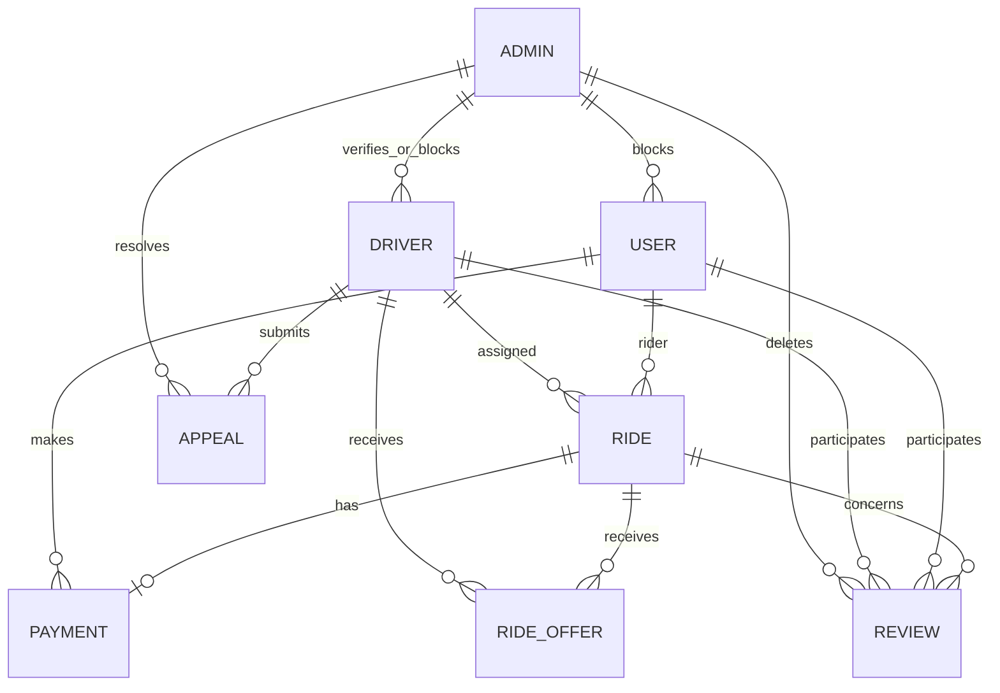

# Database

## MongoDB and Mongoose

`config/database.ts` calls `mongoose.connect(env.MONGO_URI)`. `server.ts` awaits this connection before initializing business settings, creating the HTTP server, attaching Socket.IO, and listening. Connection failures are logged and terminate the process. No global connection options, migration runner, or explicit graceful shutdown is confirmed.

## Models and relationships

| Model               | Important references and constraints                                                                    |
| ------------------- | ------------------------------------------------------------------------------------------------------- |
| User                | Unique email; `blockedBy` references Admin; rating and cancellation aggregates.                         |
| Driver              | Unique email; `blockedBy`/`verifiedBy` reference Admin; GeoJSON location and presence state.            |
| Ride                | Required `rider` User; nullable `driver` Driver; embedded route/dispatch/payment/cancellation data.     |
| RideOffer           | Ride and Driver references; unique `(ride, driver)`.                                                    |
| Payment             | Ride and User references; unique Ride; Razorpay identifiers.                                            |
| Review              | Ride reference; polymorphic User/Driver reviewer and reviewee via `refPath`; unique `(ride, reviewer)`. |
| PaymentWebhookEvent | Unique indexed event ID.                                                                                |
| EmailVerification   | Account ID in `user`, account type User/Driver, unique token; schema ref metadata says User.            |
| Appeal              | Driver and optional Admin references; status and block snapshots.                                       |
| Admin               | Unique lowercase email, role enum, password excluded by default.                                        |
| BusinessSettings    | Timestamped singleton-style settings document without a unique singleton key.                           |

## Important indexes

Driver has a `2dsphere` location index plus `isAvailable + vehicleType` and `isOnline + isAvailable`. Ride has rider/driver history indexes, driver/rider status indexes, and a status index. RideOffer indexes driver/status, ride, ride/driver/status, expiry, and unique ride/driver. Payment indexes rider/date, Razorpay order ID, and payment ID. Review indexes unique ride/reviewer and reviewee/date. Appeal indexes driver/status, status/date, and admin.

## Transactions and consistency

Online payment verification uses a MongoDB transaction to update Payment and Ride payment status together. Payment reservation/order creation, webhook Payment/Ride updates plus event insertion, offer assignment, cancellation, appeal resolution, rating recalculation, verification cleanup, and Cloudinary/model replacement are not wrapped in one transaction according to the current source.

## Initialization and cleanup

Startup creates BusinessSettings if absent. Verification cleanup runs every two minutes. Ride-offer timeout startup is commented out. No explicit migration or manual index synchronization code is confirmed; declared Mongoose indexes are relied upon.
